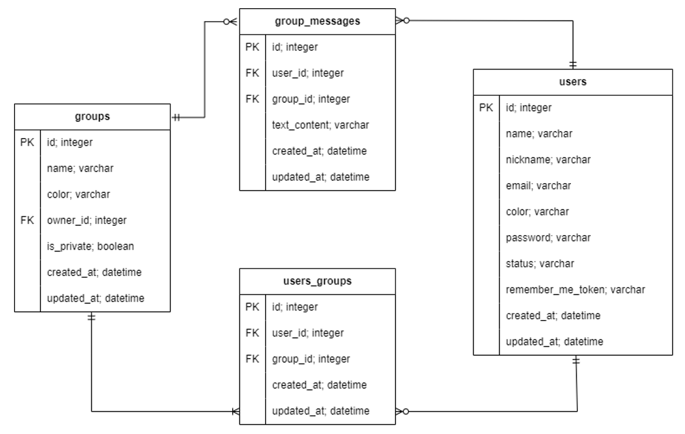

## Snack - backend

Backend of Snack, a social network PWA inspired by Slack.

### Team members

- Ján Ágh
- Irina Makarova

### Languages and frameworks

- TypeScript
- Node.js
- AdonisJS
- SQLite

### Installed packages

- `@adonisjs/lucid` - Lucid ORM for AdonisJS
- `@adonisjs/auth` - Authentication for AdonisJS
- `@ruby184/adonis-socket.io` - WebSockets support for AdonisJS
- `sqlite3` - SQLite DBMS
- `phc-argon2` - password hashing inside the database

Install the dependencies:

```bash
yarn
# or
npm install
```

Perform database migrations:

```bash
node ace migration:refresh
```

Run in development mode:

```bash
node ace serve --watch
```

### Database schema

Below can be seen the entity relationship diagram of the application's database model.



### System architecture

Below can be seen the structural architecture of the system together with details regarding information flow & processing. Components whose name starts with 'Ws' utilize WebSockets.


### Safety functionalities

- Incorporates password hashing & session token generation
- Every request to protected routes requires authentification with token
- Session tokens are saved in the LocalStorage of the user's browser
- Server side validation of any input data

Copyright &copy; 2023. All rights reserved.
