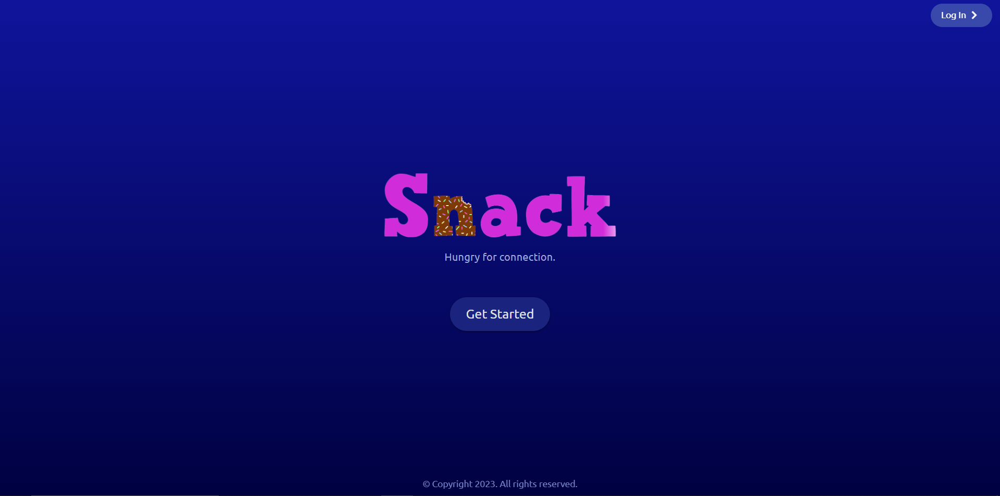
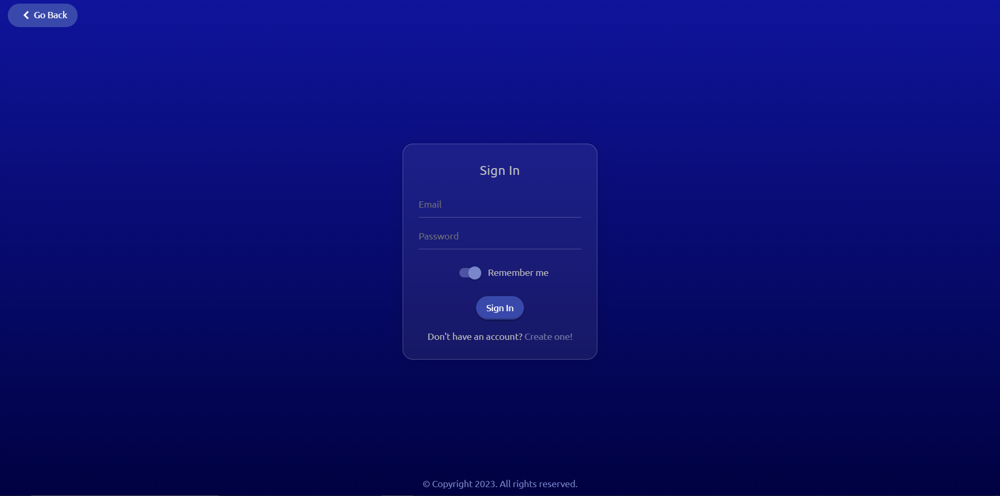
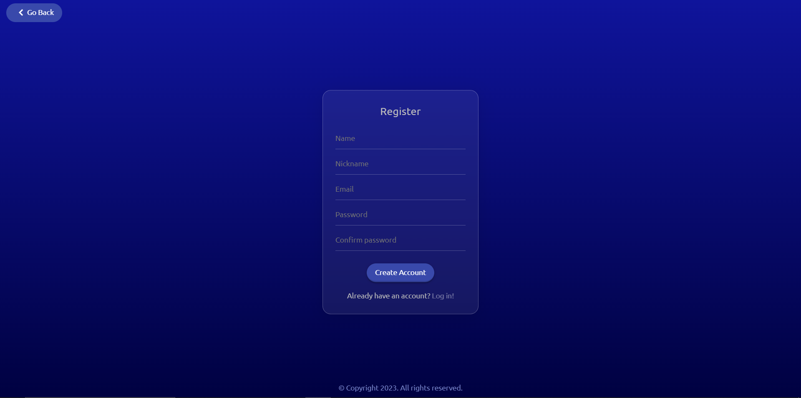
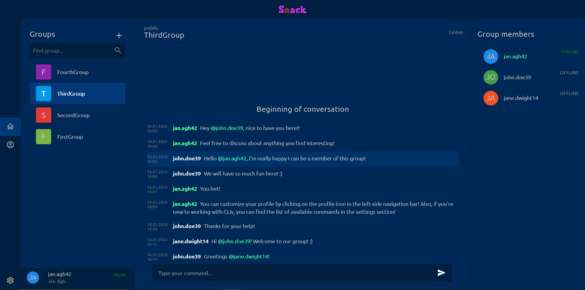
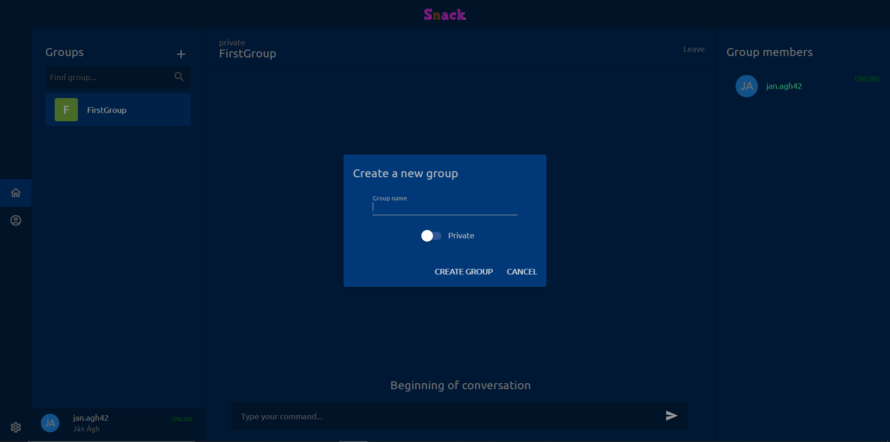
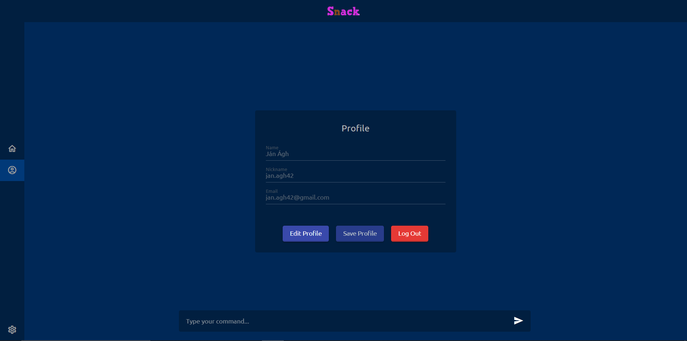
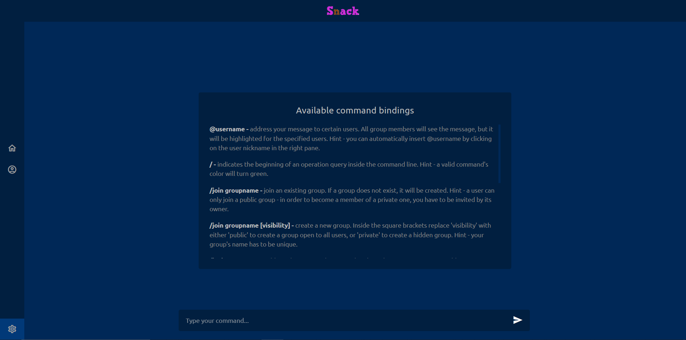

## Snack - frontend

Frontend of Snack, a social network PWA inspired by Slack.

### Team members

- Ján Ágh
- Irina Makarova

### Languages and frameworks

- TypeScript
- JavaScript
- Vue.js (composition API)
- Quasar framework
- SCSS

### Additional plugins

- `Pinia` - Vue.js store management
- `Vue Router` - application routing
- `Axios` - promise-based HTTP Client
- `socket.io-client` - WebSockets support
- `date-fns` - simplified date formatting
- `js-guid` - management of GUIDs

Install the dependencies:

```bash
yarn
# or
npm install
```

Run in development mode:

```bash
yarn quasar dev
# or
npx quasar dev
```

### Application structure

Snack consists of six pages:

- main (introductory) page
- login page
- register page
- groups panel page
- profile page
- settings page

### Design overview

The application can be accessed both from a browser, like regular SPAs, and as a PWA from the user's PC. Additionally, it's design is also responsive and is optimized for larger and smaller screen sizes.

#### Introductory page

This is the first page that gets displayed to new or logged out users. From here, they can navigate to the login and register pages.



#### Login page

Here, the users can log into their already existing accounts by filling out the required login information.



#### Register page

This page allows users to create a new account by filling out the required information:

- `name` - can contain only lowercase and uppercase letters together with spaces
- `nickname` - has to be unique and have a length of at least 5 chars
- `email` - has to be unique
- `password` - has to be alphanumeric and have a length of at least 8 chars
- `repeat password` - has to match the previously entered password

After clicking the register button, the account will be successfully created and the user will be redirected to the groups panel page.



#### Groups panel page

The groups panel page is the main page of the application. It contains:

- the list of groups the user is a member of
- the chat of the currently chosen group
- the list of members of the currently chosen group
- the application's CLI
- navigation bars on the top and left
- the panel displaying the user's information and status

It allows the users to navigate to the profile or settings pages, create new groups, browse their existing groups, change their status and chat with other group members. After the registration, the groups panel page is empty, is it can be seen on the image below.


After interacting with the application for some time, the GUI will gradually fill up with content.



Users can, besides the CLI, also create groups by utilizing the create group modal.



#### Profile page

In this page, the user has the ability to review and edit some of his personal information. The log out button is also located here.



#### Settings page

The settings page can be accessed by clicking on the gear icon in the bottom left corner of the application. It contains helpful information, like a simplified documentation for the application's CLI.



Copyright &copy; 2023. All rights reserved.
